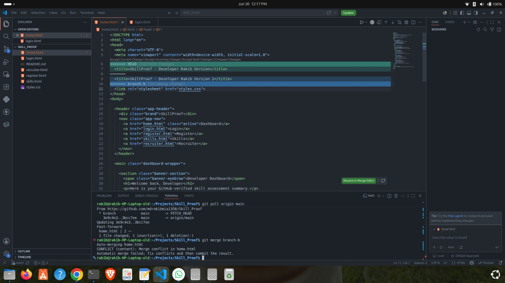

# Merge Conflict Resolution Proof

## Project
SkillProof: Evidence-Based Developer Assessment Platform

## Conflict File
home.html

## Conflict Reason
Developer A and Developer B edited the same `<title>` line in `home.html` from two different branches.

## Branches
- branch-a
- branch-b

## Conflict Versions

Developer A:
<title>SkillProof - Developer A Version</title>

Developer B:
<title>SkillProof - Developer B Version</title>

## Conflict Screenshot

The screenshot below shows the merge conflict in VS Code.

## Final Resolved Version
<title>SkillProof - Dashboard</title>

## Resolution Commit
Resolve dashboard title merge conflict

## Result
The merge conflict was successfully resolved. All conflict markers were removed, the final version was committed, and the change was pushed to the main branch.
