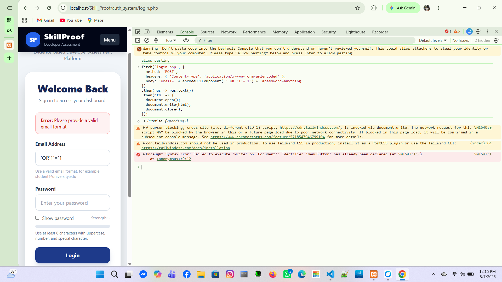

# Week 6 — Database Integration & Web Application Security: Proof of Work

## Nondini — Login / SQL Injection Defense
**File(s):** `auth_system/login.php`
**Branch:** `feature/week6-login-security-nondini`

- [x] Confirmed `$pdo->prepare()` used for the login query (no string concatenation)
- [x] Confirmed `password_verify()` used to check the password
- [x] Confirmed `session_regenerate_id(true)` runs on successful login
- [x] Tested SQLi payload `' OR '1'='1` in the email field → login correctly rejected

**Evidence:**
