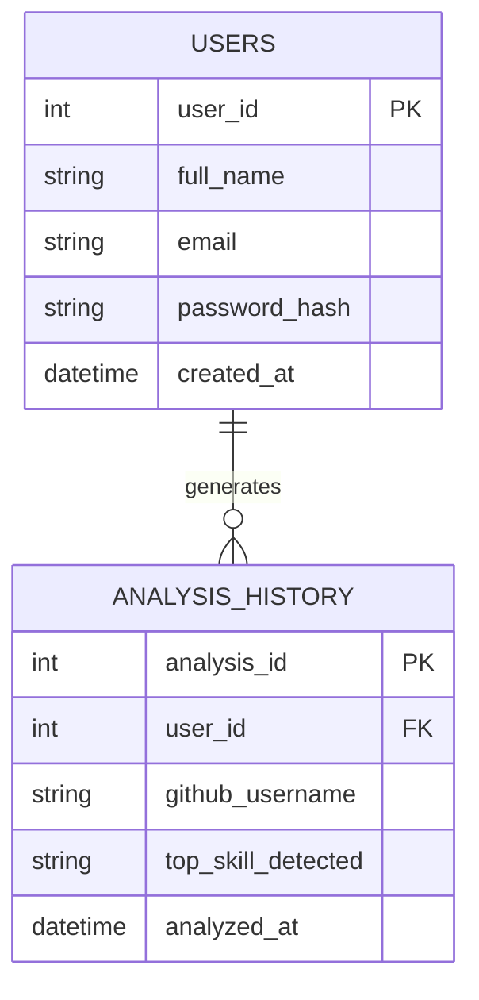

```mermaid
erDiagram
    USERS ||--o{ ANALYSIS_HISTORY : "generates"
    
    USERS {
        int user_id PK
        string full_name
        string email
        string password_hash
        datetime created_at
    }
    
    ANALYSIS_HISTORY {
        int analysis_id PK
        int user_id FK
        string github_username
        string top_skill_detected
        datetime analyzed_at
    }
```